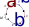

---
jupyter:
  jupytext:
    cell_metadata_filter: -all
    formats: ipynb,md
    text_representation:
      extension: .md
      format_name: markdown
      format_version: '1.3'
      jupytext_version: 1.18.1
  kernelspec:
    display_name: arsenovic-notebook
    language: python
    name: python3
---

<div style="text-align: right;">
written 01/19/2026<br>
<a href="mailto:alex@810lab.com">alex@810lab.com</a>

</div>


# Curvature

## Summary 


## Intro
For a *linear* vector manifold, the exponential of the differential, $e^{\tau \partial_a}$, implements a translation in the independent variable when operating on a function $f$. 
$$e^{\tau \partial_a}f = f(x+\tau a)    $$

for a small $\tau$. Since translations commute, 

$$ f(x+\tau a +\epsilon b) = 
e^{\tau \partial_a+\epsilon \partial_{b}}\stackrel{?}{=} 
e^{\tau \partial_a}e^{\epsilon \partial_{b}} $$

Again,  reverse the logic and assume the product of exponentials is true in general, 

$$e^{\tau \partial_a}e^{\epsilon \partial_{b}} \stackrel{?}{=} 
e^{\tau \partial_a+\epsilon \partial_{b}} $$

This is true when $\tau$ and $\epsilon$ are small, but small compared to what? Compared to the curvature. This is  what we are assuming by a *linear* vector manifold. One way to measure curvature, would be to move along $a$ then $b$, then back along $-a$ *then* $-b$. Basically reverse your steps in a different order  to get back to the start.  


\begin{align*}
\Delta f &= e^{-\tau \partial_a}e^{-\epsilon \partial_b}e^{\tau \partial_a}e^{\epsilon \partial_b}f -f\\
&=( e^{-\tau \partial_a}e^{-\epsilon \partial_b}e^{\tau \partial_a}e^{\epsilon \partial_b}-1)f\\
&= (R\tilde{R} -1)f \\
\end{align*}

Another method is to compare the difference in $f$ at some nearby point, going either way . 


\begin{align*} 
\Delta f &= e^{\tau \partial_a}e^{\epsilon \partial_b}f -e^{\epsilon \partial_b}e^{\tau \partial_a}f \\
&= (R -\tilde R )f
\end{align*}

Lets see if we can re-work this in terms of conjugation, because conjugation is  dank. 
 $$ e^{\tau \partial_a}e^{\epsilon \partial_b} fe^{\tilde{\epsilon \partial_b}}e^{\tilde{\tau \partial_a}} 
  =f(x+\tau a +\epsilon b  -\epsilon b -\tau a ) =f(x)  $$
which is a dumb thing to write when we are in a linear space. 

<!-- #region -->
### Scalar Curvature 
This section discusses scalar curvature using a non-standard convention for the differential. it is likely not of use. 


The forward differential in the a-direction $ \partial_a $ applied to a function $f$ over a linear manifold is defined by 

\begin{align}
\partial_a f &\equiv \frac{f(x+\tau a )- f(x)}{\tau} \\
\end{align}

Consider defining the backward differential with a reverse symmetry,  
\begin{align}
\  f \partial_a &\equiv \frac{f(x)-f(x-\tau a )}{\tau} \\
\end{align}

The central differential is then seen as an inner product

\begin{align}
\partial_a \cdot f \equiv \frac{1}{2}(\partial_a f + f\partial_a ) 
=\frac{ f(x+\tau a ) - f(x-\tau a )}{2\tau}
\end{align}
The second order central differential is

\begin{align}
 \partial_a \wedge f \equiv \frac{1}{2}(\partial_a f - f\partial_a ) =    
\frac{f(x+\tau a ) -2f(x)+  f(x-\tau a )}{2 \tau}

\end{align}
Note that these operations are all grade-perserving, so the usuall interpretation of the inner/outer product as grade changing is not sustained. 
what is 
\begin{align}
\partial_a f \partial_a \\
\end{align}

 the conjugation gives  

\begin{align}
e^{\tau \partial_a} fe^{-\tau \partial_a} &=T_{\tau a}f \tilde T_{\tau a} 

\end{align}

<!-- #endregion -->


### Exponetial of a  Differential

\begin{align}
\partial_a f &\equiv \frac{f(x+\tau a )- f(x)}{\tau} \\
\partial_a f&= \frac{1}{\tau}(T_{\tau a}-1)f \\
1+ \tau \partial_a  &= T_{\tau a} \\
e^{\tau \partial_a} &=T_{\tau a} 
\end{align}

The backward differential $  \partial_a $  is  
\begin{align}
\  f \partial_a &\equiv \frac{f(x)-f(x-\tau a )}{\tau}
 \\
f \partial_a &= f (1-T_{-\tau a})\frac{1}{\tau} \\
1- \tau \partial_a  &=T_{-\tau a}\\
e^{-\tau \partial_a} &=\tilde T_{\tau a} 
\end{align}


<!-- #region -->
### Domain vs Range
how do we know if an operator  will operator on the range of domain. 
 
For example take $f = x^2$
$$T_a f(x) = f(x)+a = x^2 +a $$

or 

$$T_a f(x) = f(x+a) = (x+a)^2 $$


### Rotations vs Translations 
Given that we defined the a-derivative applied to $f$ as, 
$$  \partial_a f \equiv  \frac{f(x+\tau a )- f(x)}{\tau} = \frac{1}{\tau}(T_{\tau a}-1)f $$

Where $T$ is the translation operator. If we want to make a large translation, $a$ , we could add up many small translations.   

$$ T_a = \prod (T_{\tau a})^{\frac{1}{\tau}} 
= (e^{ \tau \partial_a })^\frac{1}{\tau} =  e^{ \partial_a }$$
Maybe the use of translation in the differential could be extended to rotations.   so the finite diff would become a finite div. 


$$e^{\tau \partial_B} =R_{\tau B} $$

where B is a bivector.  Then we get 

$$ \nabla =  \sum B  \partial_B  $$
$$ \nabla = e^{B \tau \partial_B} =R_{\tau B} $$
The geometric derivative is then 

<!-- #endregion -->

```python

```

## Ortho-not-Normal


## Curvature  on a sphere

```python
from kingdon import Algebra, calculus
from kingdon.numerical import exp  as exp_
exp = lambda x: exp_(x,n=50) # precision control of exp

pga = Algebra(3,0,1,start_index=0) 
locals().update(pga.blades)

f = lambda x:3*x
x= pga.random_vector()
f(x)
lambda f,a: f+da(f,a)

```
